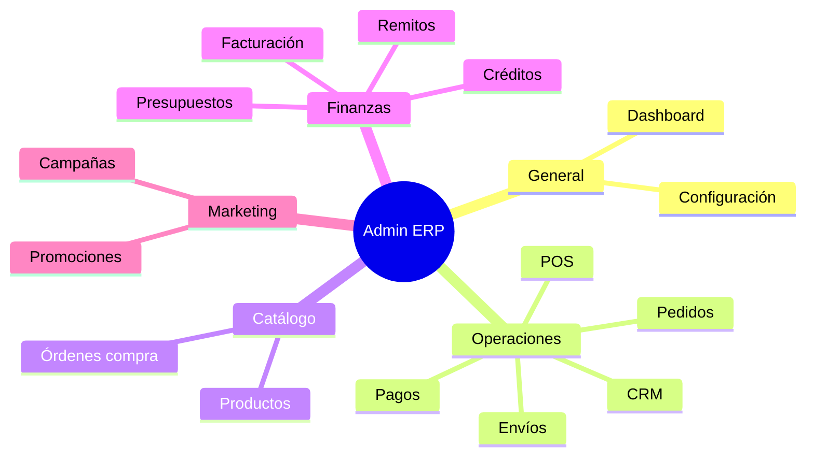

# Panel Admin ERP

Referencia funcional de todos los módulos administrativos bajo `/admin`.

## Acceso

- URL base: `/admin`
- Guard global: `adminGuard` (roles con acceso a panel ≠ CLIENTE)
- Guard por permiso: `permisoGuard('recurso.accion')` en rutas sensibles

## Mapa de módulos

## Sidebar (navegación principal)

| Sección | Ruta | Módulo |
|---------|------|--------|
| General | `/admin` | Dashboard |
| General | `/admin/configuracion` | Hub configuración |
| Operaciones | `/admin/crm` | CRM |
| Operaciones | `/admin/pedidos` | Pedidos |
| Operaciones | `/admin/pos` | POS mostrador |
| Operaciones | `/admin/pagos` | Pagos |
| Operaciones | `/admin/envios` | Envíos |
| Catálogo | `/admin/productos` | Productos |
| Catálogo | `/admin/ordenes-compra` | OC proveedores |
| Finanzas | `/admin/presupuestos` | Presupuestos |
| Finanzas | `/admin/remitos` | Remitos |
| Finanzas | `/admin/facturacion` | Facturación |
| Finanzas | `/admin/creditos` | Créditos y cuotas |
| Marketing | `/admin/promociones` | Promociones |
| Marketing | `/admin/campanas` | Campañas |

## Módulos detallados

### Dashboard (`/admin`)

**Propósito:** KPIs operativos y accesos rápidos.

**Widgets accionables:**
- Ventas hoy → pedidos
- Pedidos pendientes cobro → pedidos filtrados
- Pagos a aprobar → pagos PENDIENTE
- CRM pendientes → bandeja inbox
- Stock bajo → productos filtrados

**API:** `GET /dashboard/kpis`

**Permiso:** acceso panel (sin permiso granular).

---

### Configuración (`/admin/configuracion`)

Hub con 10 secciones:

| Sección | Ruta | Permiso |
|---------|------|---------|
| Usuarios y roles | `usuarios` | `usuarios.read` |
| Contabilidad y fiscal | `contabilidad` | `config.manage_accounting` |
| Emisores / AFIP | `emisores` | `emisores.read` |
| Plantillas impresión | `plantillas` | `config.manage_billing_templates` |
| Integraciones | `integraciones` | `config.manage_integrations` |
| Catálogos maestros | `catalogos` | `config.update` |
| Notificaciones | `notificaciones` | `config.update` |
| Seguridad | `seguridad` | `config.update` |
| Auditoría | `auditoria` | `auditoria.read` |
| Logs sistema | `logs` | `logs.read` |

Redirecciones legacy: `/admin/usuarios` → configuración/usuarios; `/admin/categorias` → catalogos.

---

### CRM (`/admin/crm`)

| Ruta | Pantalla | Permiso |
|------|----------|---------|
| `clientes` | Listado clientes | panel |
| `clientes/:id` | Ficha cliente + métricas | panel |
| `nuevo` | Alta cliente | `clientes.create` |
| `inbox` | Bandeja omnicanal | `crm.read` |

Flujo: conversación → asignar cliente → crear pedido desde ficha.

---

### Pedidos (`/admin/pedidos`)

| Ruta | Acción | Permiso |
|------|--------|---------|
| listado | Filtros canal/estado, detalle inline, CSV | `pedidos.read` |
| `nuevo` | Alta manual | `pedidos.create` |
| `?detalle=:id` | Abre panel detalle | `pedidos.read` |

Detalle incluye: líneas, pagos, envío, enlace a factura o generación.

---

### POS mostrador (`/admin/pos`)

Venta rápida en mostrador físico. Canal `POS`. Permiso: `pedidos.create`.

---

### Pagos (`/admin/pagos`)

Registro y aprobación de pagos (transferencia, QR, etc.). Filtro `?estado=PENDIENTE`. Permisos: `pagos.read`, `pagos.approve`.

---

### Envíos (`/admin/envios`)

Seguimiento logístico por pedido. Estados: PREPARANDO, EN_CAMINO, ENTREGADO. Permiso: `envios.read`.

---

### Productos (`/admin/productos`)

Inventario, stock bajo, export CSV, generación OC. Permisos: `productos.read/create/update`.

Query: `?stock=BAJO` desde dashboard.

---

### Órdenes de compra (`/admin/ordenes-compra`)

OC a proveedores, generadas desde stock bajo. Permiso: `productos.read`.

---

### Presupuestos (`/admin/presupuestos`)

Ciclo: BORRADOR → ENVIADO → ACEPTADO → factura / remito.

| Ruta | Acción |
|------|--------|
| `nuevo`, `:id/editar` | Formulario |
| `:id` | Detalle + facturar + remito |

Permiso: `facturacion.read` / `facturacion.create`.

---

### Remitos (`/admin/remitos`)

Generación desde pedido o presupuesto. Detalle con líneas y cambio de estado.

---

### Facturación (`/admin/facturacion`)

Emisión desde pedido o presupuesto. Numeración NV-AAAA-XXXXXX. IVA 21%. Préstamo personal → plan cuotas.

Query params: `?pedido=`, `?factura=` (resalta fila).

---

### Créditos (`/admin/creditos`)

Cuotas, morosidad, cobro manual. Integrado con dashboard (vencidas / por vencer).

---

### Promociones y Campañas

Marketing: descuentos activos y envíos programados (email/SMS simulado).

---

### Header admin

- **Búsqueda global:** `GET /admin/buscar?q=`
- **Notificaciones:** `GET /admin/notificaciones` (polling 60s)

## Patrón unificado de listas admin

Todas las listas principales implementan:

1. `app-admin-search` — búsqueda local
2. `app-admin-pagination` — paginación client-side
3. Estados: cargando, error, vacío
4. Export CSV en pedidos, productos, facturas
5. Detalle inline o ruta dedicada (`presupuestos/:id`, `remitos/:id`)

## Guards resumen

| Guard | Condición |
|-------|-----------|
| `authGuard` | Usuario logueado (tienda) |
| `adminGuard` | Rol con acceso panel |
| `permisoGuard` | Permiso RBAC específico |
| `guestGuard` | Solo no logueados (login/register) |
