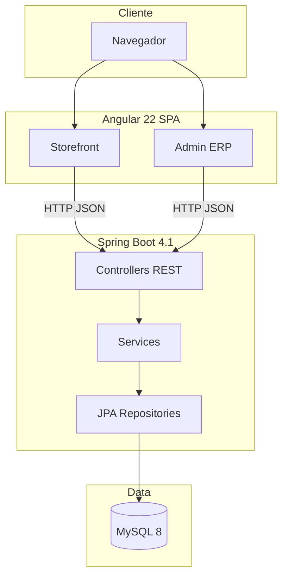
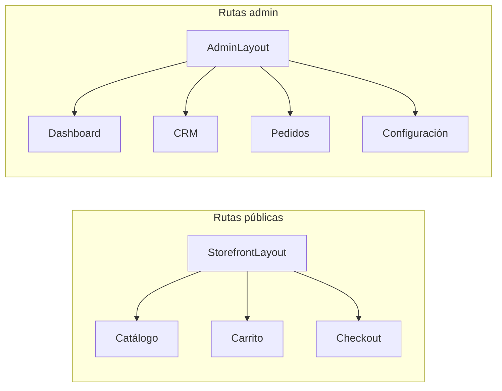
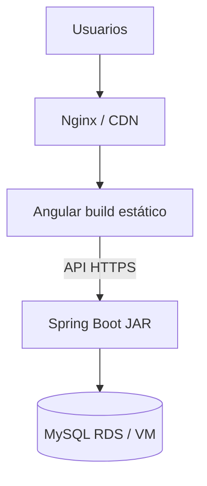

# Arquitectura del sistema

## Visión general

NovaTech ERP es una aplicación **monolito modular** con frontend SPA y backend REST stateless. El panel admin y la tienda comparten la misma API y base de datos MySQL.

## Capas del backend

| Capa | Paquete | Responsabilidad |
|------|---------|-----------------|
| Controller | `controller.*` | Endpoints REST, validación HTTP |
| Service | `service.*` | Reglas de negocio, transacciones |
| Repository | `repository.*` | Acceso a datos JPA |
| Entity | `entity.*` | Modelo persistente (Hibernate) |
| DTO | `dto.*` | Objetos de transferencia (KPIs, requests) |
| Config | `config.*` | CORS, BCrypt, beans |

No se usa Spring Security completo (filtros globales); la autorización se valida en frontend (guards + RBAC) y debe reforzarse en producción con JWT o API Gateway.

## Capas del frontend

| Capa | Ubicación | Responsabilidad |
|------|-----------|-----------------|
| Routes | `app.routes.ts` | Enrutamiento storefront / admin |
| Guards | `guards/*` | auth, admin, permiso |
| Layouts | `layouts/*` | Storefront, Admin, CRM |
| Pages | `pages/*` | Pantallas por módulo |
| Services | `services/*` | Cliente HTTP hacia API |
| Components | `components/*` | Sidebar, header, paginación, toasts |
| Interceptors | `interceptors/*` | Manejo global de errores HTTP |

## Layouts de la aplicación

- **StorefrontLayout**: header tienda + footer + outlet.
- **AdminLayout**: sidebar + header admin (búsqueda, notificaciones) + outlet.
- **CrmLayout**: sub-navegación CRM (clientes, bandeja).

## Integraciones previstas

| Canal | Estado | Ubicación |
|-------|--------|-----------|
| AFIP WSFE | Documentado / stub | Config → Emisores |
| WhatsApp / Meta | Configurable | Integraciones |
| n8n webhooks | Configurable | Integraciones |
| Correo / SMS campañas | Simulado | Campañas |

## Topología de despliegue (producción)

## Observabilidad

| Endpoint | Propósito |
|----------|-----------|
| `GET /ping` | Liveness simple |
| `GET /actuator/health` | Health con chequeo DB |
| Config → Logs | Errores técnicos 15 días |
| Config → Auditoría | Cambios de negocio |

## Decisiones arquitectónicas

1. **Monolito first**: menor complejidad operativa para MVP enterprise; módulos desacoplados por paquetes Java y carpetas Angular.
2. **RBAC en BD**: roles y permisos seed en `RbacService`; matriz editable desde configuración.
3. **Facturación sin AFIP real**: numeración interna NV-AAAA-XXXXXX; CAE simulado hasta integración WSFE.
4. **Paginación client-side**: listas admin paginadas en browser; migración a paginación server-side cuando el volumen lo exija.

## Seguridad (estado actual vs producción)

| Aspecto | Dev | Producción recomendada |
|---------|-----|------------------------|
| CORS | `*` | Origen exacto del frontend |
| HTTPS | No | TLS en reverse proxy |
| Auth API | Header implícito / rol en sesión frontend | JWT + refresh |
| Secrets | application.properties | Variables de entorno |
| SQL seed | `data.sql` always | `spring.sql.init.mode=never` |
