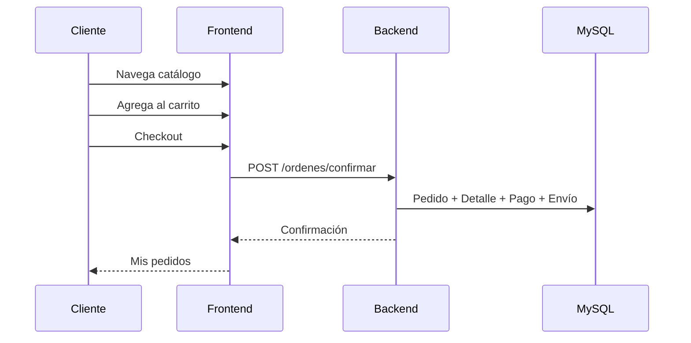
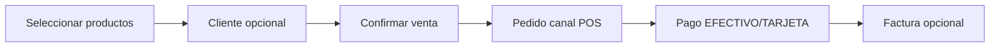
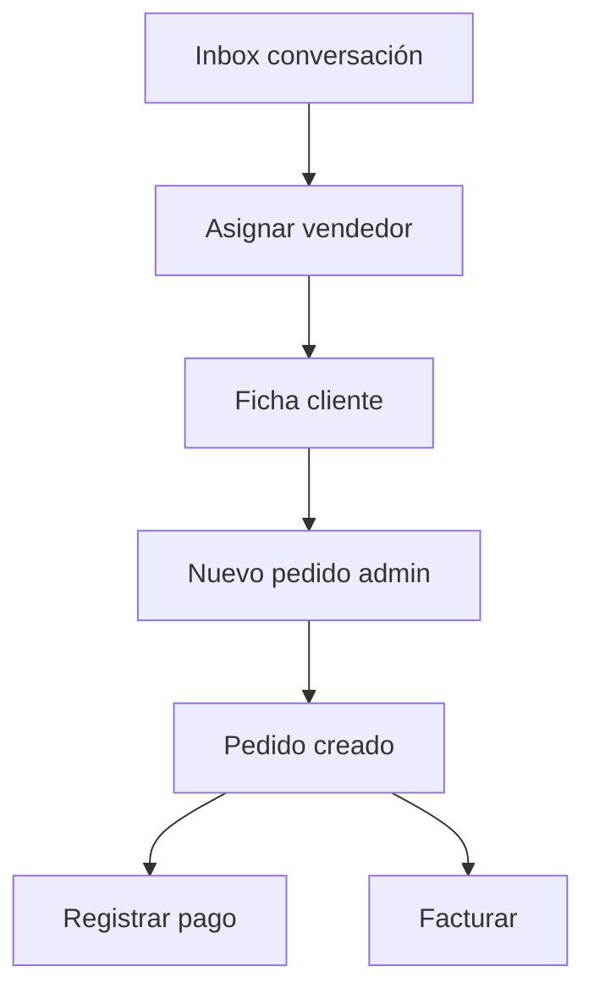
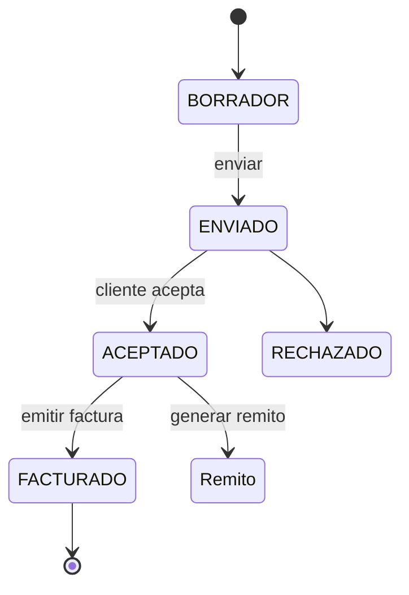
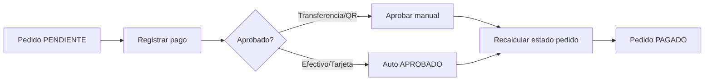
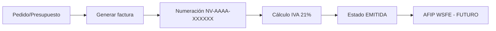

# Flujos de negocio

## 1. Venta web (e-commerce)

**Estados pedido:** PENDIENTE → (pagos) → PARCIAL/PAGADO → ENVIADO.

**Canales:** WEB (default checkout).

---

## 2. POS mostrador

Ruta admin: `/admin/pos`. Mismo endpoint `POST /ordenes/confirmar` con `canalOrigen: POS`.

---

## 3. CRM → Pedido

Bandeja: `/admin/crm/inbox`. Notificaciones CRM en header admin.

---

## 4. Presupuesto → Factura → Remito

| Paso | Acción admin | API |
|------|--------------|-----|
| Crear | `/admin/presupuestos/nuevo` | POST `/presupuestos` |
| Aceptar | Detalle → cambiar estado | POST `.../estado/ACEPTADO` |
| Facturar | Detalle → Facturar | POST `/facturas/generar-presupuesto/{id}` |
| Remito | Detalle → Generar remito | POST `/remitos/generar-presupuesto/{id}` |

Alternativa desde **pedido** directo: POST `/facturas/generar` + POST `/remitos/generar-pedido/{id}`.

---

## 5. Cobros y cartera

Dashboard muestra **cartera pendiente** = ventas totales − cobrado.

Pagos pendientes: `/admin/pagos?estado=PENDIENTE`.

---

## 6. Préstamo personal (financiación propia)

1. Al facturar, marcar "Préstamo personal" + cuotas + interés.
2. Backend crea `PlanCuotas` + `Cuota` mensuales (vencimiento día 10).
3. Módulo créditos: cobro cuotas, morosidad, campañas recordatorio.

---

## 7. Envíos

1. Checkout o pedido admin define dirección.
2. Admin actualiza estado en `/admin/envios`.
3. Tracking opcional (`numeroTracking`).

Estados: PREPARANDO → EN_CAMINO → ENTREGADO.

---

## 8. Reposición stock (OC)

1. Dashboard alerta stock bajo.
2. Productos → generar OC automática o por selección.
3. OC agrupada por proveedor.
4. Flujo: BORRADOR → ENVIADA → RECIBIDA (incrementa stock).

---

## 9. Facturación fiscal (estado actual)

**Hoy:** comprobante legal interno listo para impresión; CAE/QR AFIP documentado en ROADMAP.

---

## 10. Auditoría

Cambios sensibles (config, usuarios, emisores) registran en `RegistroAuditoria`. Consulta: Configuración → Auditoría.
