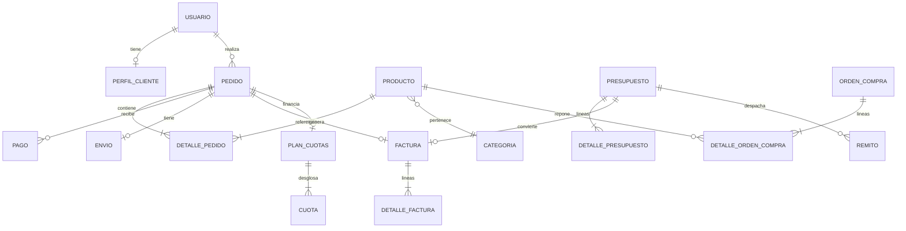

# Modelo de datos

Persistencia: **MySQL 8**, gestionada por Hibernate (`ddl-auto=update` en dev, `validate` en prod).

## Diagrama entidad-relación (núcleo comercial)

## Entidades principales

### Usuario (`usuario`)

| Campo | Tipo | Notas |
|-------|------|-------|
| idUsuario | PK | Auto |
| nombre, email | string | Único email |
| contrasena | string | BCrypt |
| rol | string | ADMIN, GERENTE, VENDEDOR, CLIENTE |

### Producto (`producto`)

| Campo | Notas |
|-------|-------|
| precio, precioLista | Venta y lista |
| stock, stockMinimo | Inventario |
| categoria | FK Categoria |
| proveedor | Para OC |

### Pedido (`pedido`)

| Campo | Notas |
|-------|-------|
| estado | PENDIENTE, PARCIAL, PAGADO, ENVIADO, CANCELADO |
| canalOrigen | WEB, POS, WHATSAPP, ADMIN… |
| tipoEntrega | ENVIO, RETIRO_TIENDA |
| total | BigDecimal |

### Pago (`pago`)

| Campo | Notas |
|-------|-------|
| metodo | TARJETA, EFECTIVO, TRANSFERENCIA, QR… |
| estado | APROBADO, PENDIENTE |
| monto | BigDecimal |

### Factura (`factura`)

| Campo | Notas |
|-------|-------|
| numeroFactura | NV-AAAA-XXXXXX |
| estado | BORRADOR, EMITIDA, ANULADA |
| tipoComprobante | A, B, C (preparado AFIP) |
| iva, subtotal, total | Fiscal |
| formaCobro | CONTADO, PRESTAMO_PERSONAL |

### Presupuesto (`presupuesto`)

Estados: BORRADOR, ENVIADO, ACEPTADO, RECHAZADO, VENCIDO, FACTURADO.

### Remito (`remito`)

Estados: BORRADOR, EMITIDO, ENTREGADO, ANULADO.

### CRM

- **Conversacion**: canal, estado (ABIERTA, PENDIENTE, CERRADA), asignadoA.
- **MensajeConversacion**: dirección IN/OUT.
- **InteraccionCrm**: timeline cliente.

### RBAC

- **RolRbac**: clave, accesoTotal, accesoPanel.
- **Permiso**: clave módulo.acción.
- **RolPermiso**: N:M rol ↔ permiso.

### Auditoría

- **RegistroAuditoria**: entidad, acción, usuario, timestamp.
- **LogSistema**: stack traces, retención 15 días.

### Configuración

- **ConfiguracionSistema**: clave-valor por grupo.
- **Emisor**: CUIT, punto venta, certificado (AFIP futuro).
- **PlantillaImpresion**: HTML factura/presupuesto/remito.
- **CatalogoMaestro**: depósitos, condiciones pago, etc.

## Tablas de soporte

| Entidad | Propósito |
|---------|-----------|
| Carrito / DetalleCarrito | Carrito activo tienda |
| Resena | Opiniones productos |
| Promocion / Campana / MensajeCliente | Marketing |
| IntegracionCanal | WhatsApp, Meta, email |
| AlicuotaIva | Alícuotas configurables |
| DetalleRemito, DetalleFactura | Líneas comprobantes |

## Índices y convenciones

- PKs autoincrement `id*`
- Fechas: `LocalDateTime` / `LocalDate` (zona AR)
- Montos: `BigDecimal` (nunca float)
- Soft-delete clientes: `activo` en PerfilCliente

## Seed de datos

`backend/src/main/resources/data.sql` carga:
- Categorías y ~20 productos demo
- Usuarios admin y clientes
- Conversaciones CRM de ejemplo
- Configuración inicial

**Producción:** desactivar seed (`spring.sql.init.mode=never`).

## Migraciones futuras

Para producción enterprise se recomienda Flyway/Liquibase en lugar de `ddl-auto=update`.
