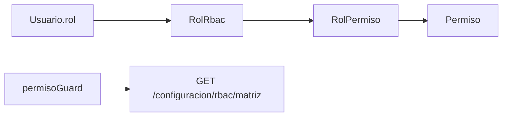

# Control de acceso (RBAC)

## Modelo

NovaTech implementa **RBAC basado en roles** con permisos granulares `modulo.accion`. La matriz se persiste en MySQL y se sincroniza al frontend vía API.



## Roles del sistema

| Rol | Panel admin | Acceso |
|-----|-------------|--------|
| SUPERADMIN | Sí | Total (`*`) |
| ADMIN | Sí | Total (legacy) |
| GERENTE | Sí | Todos los permisos seed |
| VENDEDOR | Sí | CRM, pedidos, pagos, catálogo lectura |
| CLIENTE | No | Solo tienda |

## Matriz de permisos

### Configuración y sistema

| Permiso | Descripción |
|---------|-------------|
| `usuarios.read/create/update/deactivate/assign_roles` | Gestión usuarios |
| `config.read/update` | Config general |
| `config.manage_accounting` | Contabilidad fiscal |
| `config.manage_integrations` | Integraciones |
| `config.manage_billing_templates` | Plantillas |
| `emisores.read/create/update/delete` | Emisores AFIP |
| `auditoria.read` | Ver auditoría |
| `logs.read` | Ver logs técnicos |

### CRM

| Permiso | Descripción |
|---------|-------------|
| `clientes.read/create/update/deactivate/export` | Clientes |
| `crm.read/reply/assign/manage_channels` | Bandeja omnicanal |

### Operaciones

| Permiso | Descripción |
|---------|-------------|
| `pedidos.read/create/update` | Pedidos y POS |
| `productos.read/create/update` | Catálogo |
| `pagos.read/approve` | Cobranza |
| `envios.read/update` | Logística |
| `facturacion.read/create` | Presupuestos y facturas |

## Guards en frontend

```typescript
// app.routes.ts — ejemplo
{ path: 'pedidos', component: Pedidos, canActivate: [permisoGuard('pedidos.read')] }
```

| Guard | Comportamiento |
|-------|----------------|
| `adminGuard` | Requiere rol con acceso panel |
| `permisoGuard('x')` | Requiere permiso o rol total; sino redirect a `/admin/configuracion` |

Servicio: `PermisoService.puede(permiso)` consulta matriz API + fallback estático en `config-rbac.ts`.

## Rutas protegidas por permiso

| Ruta | Permiso mínimo |
|------|----------------|
| `/admin/pedidos` | `pedidos.read` |
| `/admin/pedidos/nuevo`, `/admin/pos` | `pedidos.create` |
| `/admin/productos` | `productos.read` |
| `/admin/productos/nuevo` | `productos.create` |
| `/admin/pagos` | `pagos.read` |
| `/admin/envios`, `/admin/remitos` | `envios.read` |
| `/admin/facturacion` | `facturacion.read` |
| `/admin/facturacion/nueva` | `facturacion.create` |
| `/admin/crm/inbox` | `crm.read` |
| `/admin/configuracion/usuarios` | `usuarios.read` |
| `/admin/configuracion/auditoria` | `auditoria.read` |

## API RBAC

| Método | Ruta | Uso |
|--------|------|-----|
| GET | `/configuracion/rbac/matriz` | Roles + permisos + asignaciones |
| GET | `/configuracion/rbac/roles` | Listar roles |
| POST | `/configuracion/rbac/roles` | Crear rol custom |
| PATCH | `/configuracion/rbac/roles/{clave}` | Actualizar permisos |
| DELETE | `/configuracion/rbac/roles/{clave}` | Eliminar rol no sistema |
| GET | `/configuracion/rbac/permisos-usuario/{rol}` | Permisos de un rol |

## Cómo extender

### 1. Nuevo permiso (backend)

En `RbacService.seedPermisos()` o `asegurarPermiso()`:

```java
asegurarPermiso("reportes.read", "reportes", "Ver reportes");
asignarPermisosSiFaltan("GERENTE", List.of("reportes.read"));
```

### 2. Fallback frontend

Agregar en `config-rbac.ts` → `CONFIG_PERMISSIONS` y `ROLE_PERMISSIONS`.

### 3. Proteger ruta

```typescript
{ path: 'reportes', component: Reportes, canActivate: [permisoGuard('reportes.read')] }
```

### 4. Ocultar en UI

```typescript
@if (permisos.puede('reportes.read')) { ... }
```

## Limitaciones actuales

- La API REST **no valida permisos server-side** en todos los endpoints; el RBAC es principalmente frontend + convención. **Producción:** implementar filtro Spring Security o anotaciones `@PreAuthorize`.
- SUPERADMIN/ADMIN tienen bypass total.

## Buenas prácticas

1. Principio de mínimo privilegio para VENDEDOR.
2. Separar `read` vs `create/update/delete`.
3. Permisos de aprobación (`pagos.approve`) distintos de lectura.
4. Auditar cambios de roles en `RegistroAuditoria`.
