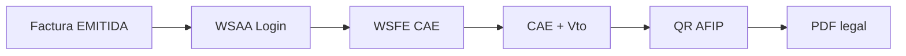

# Roadmap

## Estado actual (Jun 2026)

### Completado ✅

| Área | Entregable |
|------|------------|
| Storefront | Catálogo, carrito, checkout, mis pedidos |
| Admin core | Dashboard KPIs reales + widgets accionables |
| Operaciones | Pedidos, POS, pagos, envíos con detalle |
| Finanzas | Presupuesto → factura → remito end-to-end |
| CRM | Clientes, ficha, bandeja, métricas |
| Config | 10 secciones hub + RBAC matriz |
| Catálogo | Productos, OC stock bajo |
| Marketing | Promociones, campañas |
| Crédito | Planes, cuotas, morosidad |
| UX admin | Paginación, CSV, loading/error, toasts API |
| RBAC | Permisos operativos + guards en rutas |
| Ops | Health `/actuator/health`, perfil prod |
| Docs | Suite completa en `/docs` |

---

## P0 — Bloqueantes go-live real

| Item | Descripción | Estado |
|------|-------------|--------|
| AFIP WSFE | CAE, QR, numeración oficial | 🔴 Futuro |
| Auth API JWT | Validación server-side por token | 🔴 Futuro |
| SSL/TLS | Certificados producción | 🔴 Infra |
| RBAC backend | `@PreAuthorize` en controllers | 🟡 Parcial |
| Paginación server | Listas >1000 registros | 🟡 Client-side OK MVP |

---

## P1 — Enterprise próximo trimestre

| Item | Beneficio |
|------|-----------|
| Multi-depósito | Stock por sucursal |
| Reportes BI | Ventas, margen, aging export PDF |
| Email transaccional | SMTP real (pedido, factura) |
| Webhooks salientes | n8n, ERP contable |
| Impresión fiscal | PDF con plantillas + logo |
| 2FA admin | Config seguridad funcional |
| Backup automatizado | RPO/RTO definidos |

---

## P2 — Mejoras incrementales

| Item | Notas |
|------|-------|
| AFIP padron A5 | Validación CUIT automática |
| Mercado Pago real | SDK pagos online |
| App móvil vendedores | PWA o React Native |
| Multi-moneda | USD oficial / blue |
| WMS avanzado | Picking, packing, etiquetas |
| ML demand forecast | Reposición predictiva |
| SSO / LDAP | Empresas grandes |

---

## Deuda técnica conocida

1. Spring Security no activo — solo BCrypt + guards frontend.
2. Bundle frontend >500KB — lazy loading módulos admin pendiente.
3. `findAll()` en KPIs — optimizar con queries agregadas.
4. Tests E2E — cobertura limitada.
5. Numeración factura no atómica multi-instancia — usar secuencia DB.

---

## AFIP — plan de integración (documentado, no implementado)

Pasos futuros:
1. Config emisor con certificado .p12
2. Servicio `AfipWsfeClient`
3. Cola async emisión + reintentos
4. Storage comprobantes autorizados

---

## Métricas de éxito go-live

| KPI | Objetivo |
|-----|----------|
| Uptime API | 99.5% |
| Health check | <200ms |
| Checkout | <3s p95 |
| Emisión factura | <5s (sin AFIP) |
| Zero data.sql en prod | Obligatorio |

---

## Cómo contribuir

1. Leer [DEVELOPMENT.md](./DEVELOPMENT.md)
2. Elegir item P0/P1 del roadmap
3. Branch feature → PR con tests + doc update
4. Verificar `mvnw compile` + `npm run build`
